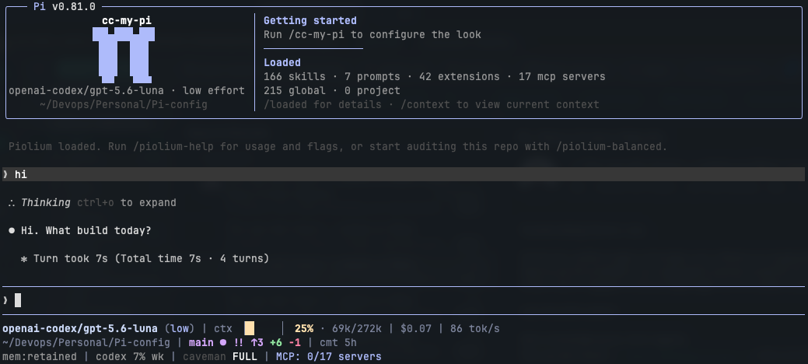
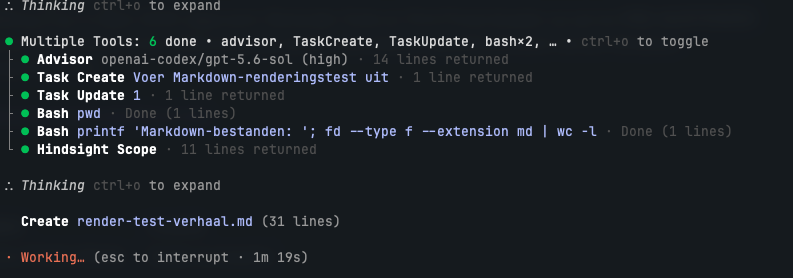
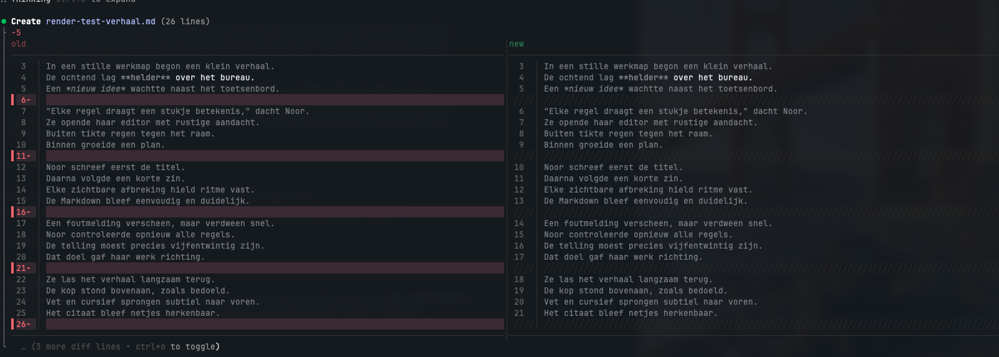
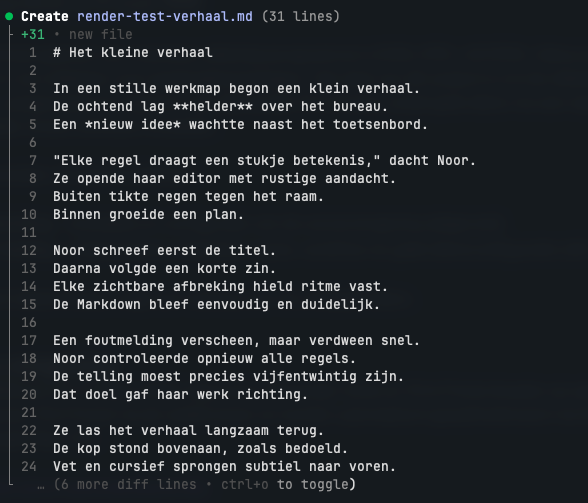
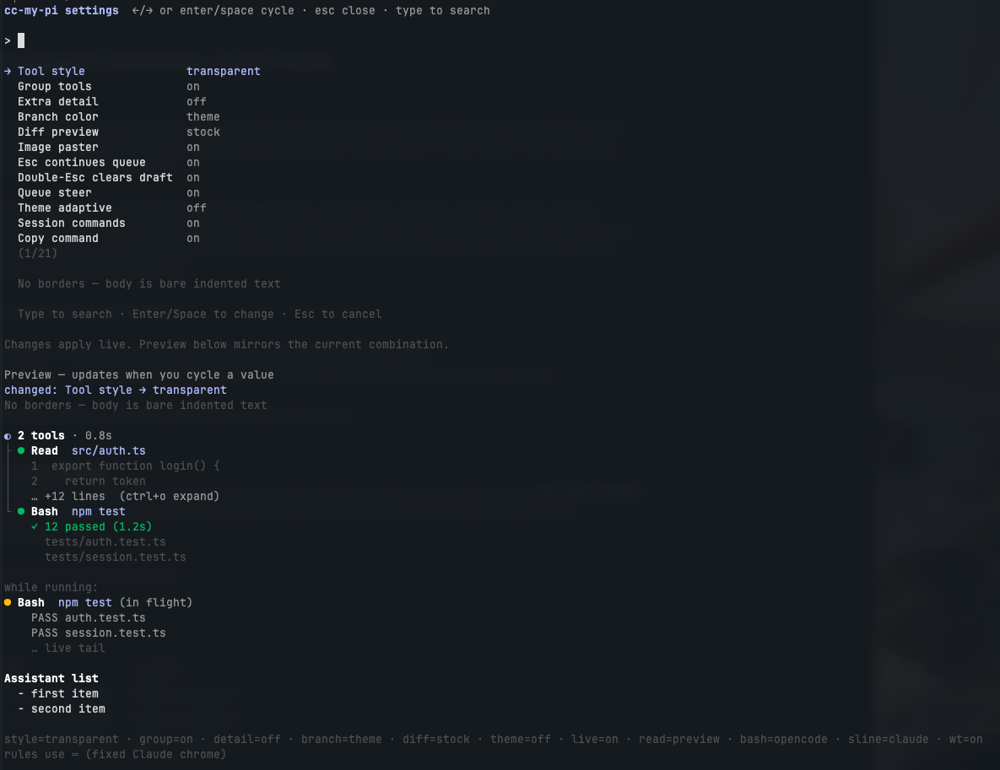
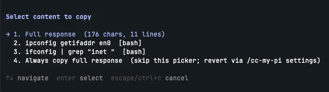
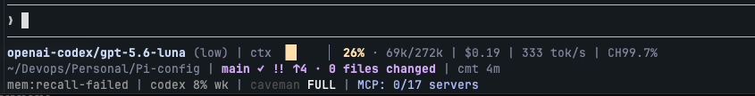
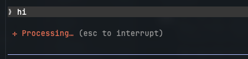
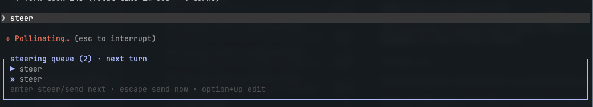
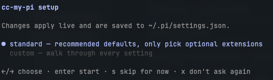

# cc-my-pi

> Personal Pi UI bundle — Claude Code-inspired tool rendering, spinner, themes, and esc/queue steering. Fork of [pi-cc-tools](https://github.com/FammasMaz/pi-cc-tools) (npm `pi-claude-code-ui`), heavily adapted. See [Credits & provenance](#credits--provenance).

Every module below is **optional and individually toggleable** — turn any of
them off in settings and the rest keeps working. Core tool rendering (the
Claude-style diffs, status dots, and borders) is the base module: it's on
whenever the package is loaded, and `toolBackground: "default"` gets you
closest to stock Pi.



## Install

1. Install from npm:

   ```text
   pi install npm:cc-my-pi
   ```

   Or for development: clone this repo and add its absolute path to the
   `packages` array in `~/.pi/agent/settings.json`
   (`"packages": ["/path/to/Pi-config/cc-my-pi"]`).
2. Run `/reload` (or restart Pi) to load it.
3. First load auto-starts the guided setup wizard (`/cc-my-pi setup`). Its
   intro asks whether you want the **standard** setup (recommended defaults,
   you only pick optional extensions) or **custom** (walk through every
   setting) — use `←/→` to choose. `s` skips for now (re-opens next session)
   and `x` never asks again. Both paths then show a single **optional
   extensions** checkbox screen (see [Goes well with](#goes-well-with)): `↑/↓`
   move, `space` selects, `enter` installs the checked packages via the real
   `pi install` CLI (they activate after `/reload`). Only **custom** then
   continues into the full per-setting walkthrough. Re-run any time with
   `/cc-my-pi setup`.

To uninstall, remove the `npm:cc-my-pi` (or path) entry from `packages` and `/reload`.

## Quick start

```text
/cc-my-pi                 # open interactive settings panel (live ASCII preview)
/cc-my-pi setup           # guided walkthrough of every setting (auto-runs once on first load, re-runnable any time)
/cc-my-pi status          # text dump of style, grouping, branch, diff
```

Every subcommand hangs off the single root command `/cc-my-pi`:

```text
/cc-my-pi ui|settings|status|outlines|transparent|default|group|detail|branch|diff|theme|spinner|setup
```

## Screenshots

**Tool rendering** — grouped tool rows (⏺ dots, collapsed `∴ Thinking`, spinner with esc hint)



**Diff rendering** — side-by-side edit/write diff



**New-file create** — plain new-file preview with line numbers



**Settings panel** — `/cc-my-pi` with live ASCII preview



**`/copy-code` content picker**



**Statusline** — model/ctx gauge, git segment, MCP status



**Spinner** — Claude-style verb + esc hint



**Queue steer** — visible steering/follow-up queue with inline editing



**Setup wizard** — first-run intro: standard vs custom



## Modules

All settings live in `~/.pi/settings.json` (or `./.pi/settings.json` for a
project override) as plain JSON keys — the panel and wizard just write to the
same file.

| Module | What you get | Setting | Default | Applies |
|---|---|---|---|---|
| Core tool rendering | Compact `read`/`bash`/`grep`/`find`/`ls`/`edit`/`write` rows, Claude-style OpenAI/`apply_patch` tools, minimal diff chrome, thinking labels, MCP-aware rendering | — (base module, always on while loaded) | on | — |
| Spinner | Claude-style spinner verb + status text (falls back to Pi's stock spinner when off) | `spinnerEnabled` | `true` | reload |
| Startup header | Boxed header (forked from `pi-claude-code-tui`) — Claude Code proportions: a narrow left column with an animated π mascot + model/effort/cwd, and a wide right column with a **Loaded** panel counting skills · prompts · extensions · mcp (with a global/project split) plus a `/loaded for details` hint; off falls back to the one-line `✻ Welcome to Pi` header | `claudeHeaderEnabled` | `true` | reload |
| Quiet startup | Sets Pi's native `quietStartup` (in `~/.pi/agent/settings.json`) to hide the startup resource listing — use `/loaded` to see it on demand. The wizard defaults this on when the header is enabled | `quietStartup` | `false` | next session |
| `/loaded` command | Always registered — prints loaded skills, prompts, extensions, themes and MCP servers, grouped global vs project | — (always on) | on | — |
| Session commands | `/exit` (clean shutdown) and `/clear` (alias for `/new`; replaces the `pi-clear` npm package) | `sessionCommandsEnabled` | `true` | reload |
| Copy command | `/copy-code` — Claude-style picker to copy the last response or one of its code blocks to the clipboard | `copyCommandEnabled` | `true` | reload |
| Image paster | Clipboard images and pasted image paths become first-class attachments (bundled `pi-paster`) | `imagePasterEnabled` | `true` | reload |
| Esc steer | Esc while the agent runs aborts and auto-continues whatever was queued | `escSteerEnabled` | `true` | live |
| Double-Esc clear | Double-Esc (within 800ms) on a non-empty idle draft clears it | `doubleEscClearEnabled` | `true` | live |
| Queue steer | Vendored `pi-queue-steer` — visible steering/follow-up queue | `queueSteerEnabled` | `true` | live |
| Theme-adaptive palette | Borders, branch connectors, dim text, spinner accent, and diff backgrounds follow the active pi theme | `themeAdaptive` | `true` | live |
| Grouped tool calls | Adjacent/concurrent tool calls collapse under a compact status header | `groupToolCalls` | `true` | live |
| Live tool preview | A few output lines shown for still-running tool calls | `liveToolPreview` | `true` | live |
| Statusline | Bundled footer module: model/ctx gauge, git segment (with the `+N −N` line diffstat), MCP status, and a thinking level color-coded to match the editor border. Sub-settings `statuslineCtxStyle` (context gauge style) and `statuslineShowWorktree` (`wt <name>` segment) apply live (≤5s) | `statuslineEnabled` (module on/off), `statuslineCtxStyle`, `statuslineShowWorktree` | `true`, `"claude"`, `true` | `statuslineEnabled` reload; sub-settings live (≤5s) |

One example per module — set just the key(s) you want to change:

```json
{ "spinnerEnabled": false }
```
Disables the Claude-style spinner; Pi's stock spinner takes over after `/reload`.

```json
{ "claudeHeaderEnabled": false }
```
Falls back to the one-line `✻ Welcome to Pi` header after `/reload` (the animated
boxed header is off). Don't install `npm:pi-claude-code-tui` alongside cc-my-pi —
its header is already vendored here, and running both would draw two headers.

```json
{ "sessionCommandsEnabled": false }
```
`/exit` and `/clear` are no longer registered after `/reload`.

```json
{ "copyCommandEnabled": false }
```
`/copy-code` is no longer registered after `/reload`. When enabled, `/copy-code` copies
the last assistant response to the clipboard. If that response contains fenced
code blocks it first shows a **Select content to copy** picker — the full
response (with char/line count), each code block (labelled by language), and an
**Always copy full response** entry that persists a skip-the-picker preference.
Turn the picker back on with the `Copy picker` toggle in `/cc-my-pi settings`.

```json
{ "imagePasterEnabled": false }
```
Clipboard/pasted images are no longer captured as attachments; reload to apply.

```json
{ "escSteerEnabled": false }
```
Esc goes back to only pausing the run — no auto-continue of queued follow-ups.

```json
{ "doubleEscClearEnabled": false }
```
Double-Esc on a non-empty draft no longer clears it.

```json
{ "queueSteerEnabled": false }
```
Removes the visible steering/follow-up queue; Pi's native queue still works.

```json
{ "themeAdaptive": false }
```
Keeps the fixed Claude-style palette regardless of the active pi theme.

```json
{ "groupToolCalls": false }
```
Adjacent tool calls render as separate rows instead of a grouped block.

```json
{ "liveToolPreview": false }
```
Still-running tool calls no longer show a live output preview.

```json
{ "statuslineEnabled": false }
```
Disables the bundled statusline module (model/ctx gauge, git segment, MCP status); Pi's stock footer takes over after `/reload`.

```json
{ "statuslineCtxStyle": "plain", "statuslineShowWorktree": false }
```
Statusline switches to a plain context style and drops the `wt <name>` worktree segment.

## Theme

The package ships the **`cc-my-pi-dark`** theme (Claude Code-style dark palette),
registered automatically via the package manifest. Activate it by setting
`"theme": "cc-my-pi-dark"` in `~/.pi/agent/settings.json` (or via Pi's theme
switcher), then `/reload`.

## Goes well with

Not bundled (standalone npm packages). Both `/cc-my-pi settings` and the setup
wizard list these as optional companion rows with their install state
(`✓ installed` / `✗ not installed`). In the panel, cycle a row to `⏎ install`;
in the wizard, `space`-select them on the optional-extensions screen. Either way
they install via the real `pi install` CLI and activate after `/reload`.
Skipping is the default.

- [`pi-context-view`](https://github.com/dimk90/pi-context-view)
  (`npm:pi-context-view`, MIT — Dmitry Makarov) — visualizes what fills the
  model's context and lets you inspect the normally hidden parts (base
  prompt, tool schemas, extension injections). Pairs nicely with the
  statusline's context gauge.
- [`pi-mcp-adapter`](https://www.npmjs.com/package/pi-mcp-adapter)
  (`npm:pi-mcp-adapter`, MIT) — adapter that lets Pi use MCP (Model Context
  Protocol) servers, exposing their tools inside your session.
- [`pi-subagents`](https://www.npmjs.com/package/pi-subagents)
  (`npm:pi-subagents`, MIT) — delegate work to subagents with chained and
  parallel execution and a TUI for clarifying questions.

## Configuration reference

Full settings block (see [Modules](#modules) above for module toggles —
not repeated here):

```json
{
  "toolBackground": "border",
  "readOutputMode": "preview",
  "searchOutputMode": "preview",
  "mcpOutputMode": "preview",
  "previewLines": 8,
  "expandedPreviewMaxLines": 4000,
  "extraExpandedPreviewMaxLines": 12000,
  "extraToolOutputExpanded": false,
  "bashOutputMode": "opencode",
  "bashCollapsedLines": 10,
  "liveToolPreviewLines": 5,
  "diffCollapsedLines": 24,
  "diffTheme": "github-dark"
}
```

### Output modes

| Setting | Values | Default |
| --------- | -------- | --------- |
| `readOutputMode` | `hidden`, `summary`, `preview` | `preview` |
| `searchOutputMode` | `hidden`, `count`, `preview` | `preview` |
| `mcpOutputMode` | `hidden`, `summary`, `preview` | `preview` |
| `bashOutputMode` | `opencode`, `summary`, `preview` | `opencode` |

### Display settings

| Setting | Default | Description |
| --------- | --------- | ------------- |
| `previewLines` | `8` | Lines shown in collapsed preview mode |
| `expandedPreviewMaxLines` | `4000` | Max lines when expanded with Ctrl+O |
| `extraExpandedPreviewMaxLines` | `12000` | Max lines after Ctrl+Shift+O extra-detail mode |
| `extraToolOutputExpanded` | `false` | Start with Ctrl+Shift+O extra-detail mode enabled |
| `bashCollapsedLines` | `10` | Lines for collapsed bash output |
| `liveToolPreviewLines` | `5` | Lines shown in the collapsed live preview |
| `diffCollapsedLines` | `24` | Diff lines before collapsing |

Assistant Markdown unordered lists always render with `-` markers (Claude Code parity; not configurable).

### Tool background modes

| Value | Behavior |
| ------- | ---------- |
| `default` | Standard Pi tool backgrounds |
| `transparent` | Transparent tool backgrounds |
| `border` | Transparent backgrounds with top/bottom border lines |

```text
/cc-my-pi outlines        # tool style: outlines, transparent, or default
/cc-my-pi group toggle    # toggle grouped adjacent/concurrent tool calls
/cc-my-pi group off       # disable grouping (also ungroups current grouped rows)
/cc-my-pi detail toggle   # same mode as Ctrl+Shift+O
```

The settings panel lists style, grouping, extra detail, branch color,
image paster, Esc continues queue, double-Esc clears draft,
theme-adaptive, spinner verb/status colors, live preview, and read/bash
output modes. Most changes apply immediately; changing image paster or the
spinner module requires `/reload`. The preview block under the list shows a
mock tool tree for the current combination.

## Theme integration

When `themeAdaptive` is `true` (default), the following colors are derived from the active pi theme on every render and re-derived whenever the theme changes:

| Element | Derived from |
| --------- | -------------- |
| User box, tool rules, code fences | `dim` → `muted` → `borderMuted` → `thinkingText` |
| Branch connectors (`├`, `└`, `│`) | **fixed rgb(128)** by default (theme-independent); `/cc-my-pi branch theme` to follow pi theme |
| "✻ Turn took Ns" line (final message only, with session total + turn count) | `muted` |
| Thinking-block text and `∴` marker (marker hidden when thinking is collapsed) | `muted` |
| Diff add/remove accents | `toolDiffAdded` / `toolDiffRemoved` |
| Diff background tints | mixed against `toolSuccessBg` base |
| Spinner verb text (`Working…`) | `borderAccent` (fallback: `accent`) |
| Spinner status text | `muted` |

User-supplied `diffTheme` presets and `diffColors` overrides always win over theme-derived defaults. File-type icons (e.g. `ts`, `py`, `rs`) keep their language-identity colors and are not theme-derived.

Set `themeAdaptive: false` to keep the original fixed Claude-style palette regardless of the active pi theme.

On `/resume`, `/new`, or `/fork`, tool chrome is rebound from the **current** pi theme (no coupling to Ghostty or other theme extensions). If you use Ghostty sync, listing it **above** this extension in `settings.json` is recommended so `setTheme` runs before chrome rebind.

### Toggle at runtime with `/cc-my-pi theme`

```text
/cc-my-pi theme           # show current setting + theme name
/cc-my-pi theme status    # show current setting + color preview (incl. spinner)
/cc-my-pi theme on        # follow pi theme
/cc-my-pi theme off       # keep fixed Claude palette
/cc-my-pi theme toggle    # flip the current value
```

The selection is persisted to `~/.pi/settings.json` and applied to the next rendered tool row. No restart required.

### Repaint the spinner with `/cc-my-pi spinner`

The spinner glyph itself is still colored by pi's loader using `accent`, while the verb text (e.g. `Cooking…`) follows `borderAccent` by default so it stays lively without being the exact same color as the glyph. The status suffix (e.g. `(thinking · ↓ 10 tokens · 2s)`) follows `muted`. Use `/cc-my-pi spinner` to bind either text element to any other theme color key:

```text
/cc-my-pi spinner preview          # list every common theme key with a colored sample
/cc-my-pi spinner verb <key>       # change the verb color (e.g. thinkingHigh, mdHeading)
/cc-my-pi spinner status <key>     # change the status suffix color
/cc-my-pi spinner reset            # restore defaults (verb=borderAccent, status=muted)
```

The selection is persisted as `spinnerVerbColor` / `spinnerStatusColor` in `~/.pi/settings.json` and applied on the next spinner tick.

`spinnerVerbColor`, `spinnerStatusColor`, and `spinnerGlyphColor` also accept a `#rrggbb` hex literal instead of a theme key — a hex value bypasses theme lookup entirely and always renders that exact color, even with `themeAdaptive: false` or no theme loaded. `spinnerGlyphColor` (unset by default) overrides the glyph color that pi's loader would otherwise pick; set it to bind the glyph to the same brand color as the verb, e.g.:

```json
{
  "spinnerVerbColor": "#d77757",
  "spinnerGlyphColor": "#d77757"
}
```

### Bundled Esc behaviors

Two Escape reflexes from Claude Code ship bundled and **default to on**. Toggle
either live from the `/cc-my-pi` settings panel (no reload needed):

| Setting | Default | Behavior |
| --------- | --------- | ---------- |
| `escSteerEnabled` | `true` | While the agent runs, Esc aborts the current run and then auto-continues whatever was queued (steer / follow-up) instead of only pausing. Composes with the optional `git:github.com/tmustier/pi-queue-steer` package and with Pi's native queue. |
| `doubleEscClearEnabled` | `true` | On a non-empty idle draft, double-Esc (within 800 ms) clears the editor, matching Claude Code. Pi's own empty-editor double-Esc (tree / fork selector) is untouched. |

`escSteerEnabled` is the bundled copy of the standalone `pi-esc-steer` package
and shares its feature marker, so the two are mutually exclusive automatically.
`doubleEscClearEnabled` is vendored from
[`@thisux/pi-double-esc-clear`](https://www.npmjs.com/package/@thisux/pi-double-esc-clear)
v1.0.3 (MIT, author Sanju <https://sanju.sh/>).

If you previously installed either standalone package, remove it so it is not
loaded twice:

```bash
pi remove npm:pi-esc-steer
pi remove npm:@thisux/pi-double-esc-clear
```

esc-steer dedups automatically via the shared feature marker; double-esc-clear
cannot detect the standalone package, so a leftover install would double-wrap
(harmless — the inner clear empties the draft and the outer sees nothing to do —
but removing it is cleaner).

## Notes

This package targets recent Pi versions where tool renderers use:

- `renderCall(args, theme, context)`
- `renderResult(result, { expanded, isPartial }, theme, context)`

Unknown/custom tools do not have a public global renderer hook in Pi, so this package patches container rendering to add top/bottom borders for all tool executions in border mode.

## Credits & provenance

cc-my-pi is not an original work — it stands on these projects:

| Component | Upstream | Author | License |
|---|---|---|---|
| Core tool rendering, diffs, spinner, settings UI (base fork) | [FammasMaz/pi-cc-tools](https://github.com/FammasMaz/pi-cc-tools) (npm `pi-claude-code-ui`) | FammasMaz | MIT |
| `extensions/queue-steer/` (vendored, adapted) | [tmustier/pi-queue-steer](https://github.com/tmustier/pi-queue-steer) | Thomas Mustier | MIT |
| `extensions/esc-steer.ts` (vendored, adapted) | `pi-esc-steer` | Thomas Mustier | MIT |
| `extensions/double-esc-clear.ts` (vendored, adapted) | [`@thisux/pi-double-esc-clear`](https://www.npmjs.com/package/@thisux/pi-double-esc-clear) v1.0.3 | [Sanju](https://sanju.sh/) | MIT |
| `extensions/claude-header/` (forked — header only; layout, π mascot and Loaded panel are original cc-my-pi work) | [Phoobobo/pi-claude-code-tui](https://github.com/Phoobobo/pi-claude-code-tui) v0.1.10 | Phoobobo | MIT |
| Visual design reference | [Claude Code](https://github.com/anthropics/claude-code) (Anthropic) — glyphs, colors, and layout re-implemented, no code copied | — | — |
| Syntax highlighting | [Shiki](https://shiki.style) (`@shikijs/cli`) | Shiki contributors | MIT |
| Diff engine | [jsdiff](https://github.com/kpdecker/jsdiff) (`diff`) | Kevin Decker & contributors | BSD-3-Clause |
| Image pasting | [beowulf11/pi-paster](https://github.com/beowulf11/pi-paster) (npm `pi-paster`) | beowulf11 | MIT (package.json; no LICENSE file upstream) |

The base fork itself builds upon and was inspired by:

- **[@heyhuynhgiabuu/pi-pretty](https://github.com/buddingnewinsights/pi-pretty)** by [huynhgiabuu](https://github.com/buddingnewinsights) — Pretty terminal output with syntax-highlighted file reads, colored bash output, and tree-view directory listings
- **[@heyhuynhgiabuu/pi-diff](https://github.com/buddingnewinsights/pi-diff)** by [huynhgiabuu](https://github.com/buddingnewinsights) — Shiki-powered terminal diff renderer with word-level diffs in split and unified views
- **[pi-tool-display](https://github.com/MasuRii/pi-tool-display)** by [MasuRii](https://github.com/MasuRii) — Compact tool call rendering, diff visualization, and output truncation

Vendored-copy details, pinned versions, and the exact local deltas live in
[VENDOR.md](./VENDOR.md). The base fork has diverged substantially from
upstream (see [CHANGELOG.md](./CHANGELOG.md) and the `plans/` history in the
parent Pi-config repo); bugs here are mine, not the upstream authors'.

## License

MIT — see [LICENSE](./LICENSE). Fork it, tweak it, ship your own variant;
just keep the copyright notices (this fork's, FammasMaz's original, and the
vendored components' — see [Credits & provenance](#credits--provenance)).
